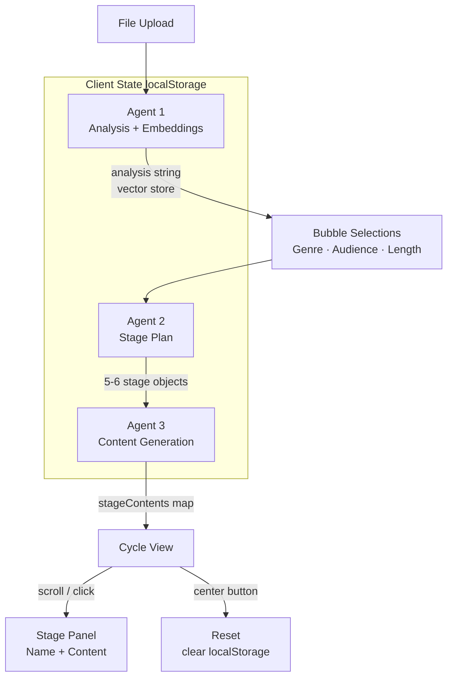

# ProjectStory

Turn any document into a structured, AI-generated narrative — staged and styled to your audience, rendered inside an animated glassmorphism UI.


## Overview

ProjectStory is a browser-only single-page app that accepts a document upload and runs it through a three-agent AI pipeline to produce a lifecycle story — phase-by-phase content written for a chosen audience, genre, and length. The user configures all three dimensions by interacting with animated water-bubble controls before any generation starts. There is no backend; all AI calls run client-side using either Google Gemini or Anthropic Claude, and all state persists in `localStorage` across sessions.

## Highlights

- **Dual AI provider support** — choose Google Gemini (`gemini-2.5-flash` + `text-embedding-004`) or Anthropic Claude (`claude-3-5-sonnet`) at runtime with no code change
- **Three-agent sequential pipeline** — file analysis and RAG embeddings, stage plan generation, and stage content generation run in strict order, each result feeding the next
- **Client-side RAG** — document chunks are embedded with Gemini's `text-embedding-004` model and stored in browser state; the context store is sliced into the content prompt without a server
- **Glassmorphism bubble interface** — concentric-ring bubble layout with CSS keyframe animations (`wiggle`, `splitOutDynamic`, `splash`, `waterTransition`) driven entirely by polar-to-Cartesian coordinate math at runtime
- **Full session persistence** — API keys, provider choice, generated stages, vector store, and current view all survive page reloads via `localStorage`
- **Adaptive content sizing** — font class is chosen dynamically based on the ratio of generated word count to the user-selected length target (Short / Medium / Long)

## Features

**AI Pipeline**
- Agent 1 classifies document type, domain, and themes; creates vector embeddings for RAG context
- Agent 2 produces 5–6 domain-specific lifecycle stages with name, description, color, and a weight that controls visual arrow length
- Agent 3 generates all stage content in a single API call, audience-tuned and genre-styled
- Fallback stage plan activates automatically if JSON parsing fails

**UI / Interaction**
- File upload triggers a bubble-split animation; each of the three category bubbles (Genre, Audience, Length) expands its options onto an outer ring
- Option selection collapses the ring and recalculates remaining bubble positions in real time
- Cycle view: rotatable arrow wheel on the left, animated content panel on the right; scroll wheel and click both rotate
- Click anywhere on the background to spawn a water-ripple effect at the cursor position
- Reset button clears `localStorage` and returns to the initial upload state

**Configuration**
- Provider selector (Gemini / Claude) with separate API key inputs
- `ANALYZE_FULL_FILE` flag controls whether the document is chunked (2 000-character segments) or sent whole — default is a single-call approach for speed

## Tech Stack

| Layer | Technology | Purpose |
|---|---|---|
| Framework | React 19 | Component model and state management |
| Language | TypeScript 5.8 | Type safety across agents and UI state |
| Build | Vite 7 | Dev server and production bundler |
| Styling | Tailwind CSS 4 (PostCSS) | Utility classes, glassmorphism, gradient palette |
| AI — primary | Google Gemini (`@google/generative-ai` 0.24) | Text generation (`gemini-2.5-flash`) and embeddings (`text-embedding-004`) |
| AI — alternate | Anthropic Claude (`@anthropic-ai/sdk` 0.65) | Text generation (`claude-3-5-sonnet-20241022`) |
| Icons | Lucide React 0.544 | Upload, FileText, Eye, Ruler, RotateCcw icons |
| Persistence | Browser `localStorage` | Session state, API keys, generated content |

## Architecture



## How It Works

1. **API key setup** — on first load a modal prompts for a provider choice (Gemini or Claude) and the corresponding API key. The key is stored in `localStorage` for subsequent sessions.

2. **File upload and Agent 1** — uploading a `.txt`, `.md`, or image file triggers `analyzeFileAndCreateEmbeddings`. The document is sent to the chosen model for domain/theme classification, then each chunk is embedded with `text-embedding-004` (Gemini) or a random-vector fallback (Claude) and stored in component state as a vector store.

3. **Bubble selection** — three category bubbles (Genre, Audience, Length) split out from the center. Clicking one expands its options onto a 280 px outer ring. Each selection pops that category's options and recalculates angular positions for any remaining bubbles using even 360° distribution.

4. **Agents 2 and 3** — once all three categories are selected, `createStagePlan` builds a genre- and audience-aware stage plan from the document analysis. Then `createStageContent` uses the first three vector-store chunks as RAG context and generates all stage content in a single prompt.

5. **Cycle view** — the app transitions to a split layout: a rotating arrow wheel (one arrow per stage, length proportional to `weight`) on the left, and a wiggling glassmorphism panel on the right that displays the active stage's generated content. Scroll or click to rotate; font size adjusts based on how much text was generated relative to the word-limit target.

6. **Reset** — the center `RotateCcw` button clears `localStorage` and returns to the upload screen.

## Setup

**Prerequisites:** Node.js 18+ and npm.

```bash
# Install dependencies
npm install

# Start development server
npm run dev

# Type-check and build for production
npm run build

# Preview the production build
npm run preview

# Lint
npm run lint
```

No `.env` file is needed. API keys are entered at runtime in the browser UI and are stored in `localStorage`.

## Usage

1. Open the app in a browser (default: `http://localhost:5173`).
2. Choose a provider (Google Gemini or Anthropic Claude) and paste an API key.
   - Gemini keys: [aistudio.google.com/app/apikey](https://aistudio.google.com/app/apikey)
   - Claude keys: [console.anthropic.com](https://console.anthropic.com/)
3. Click the pulsing upload bubble and select a `.txt` or `.md` file.
4. Click each of the three category bubbles in turn and select an option from the outer ring:
   - **Genre** — Struggle, Horror, Mystical, Fantasy, Adventure, Romance
   - **Audience** — Professional, Kid, Teenager, General, Academic
   - **Length** — Short (50 words), Medium (80 words), Long (120 words)
5. Wait for the three-agent pipeline to complete. The app transitions automatically to the cycle view.
6. Scroll or click arrows to navigate stages. The right panel shows stage name and AI-generated content.
7. Click the center circle to reset and process a new document.

## Key Decisions

| Decision | Rationale | Tradeoff |
|---|---|---|
| Sequential agent execution | Each agent depends on the previous result; parallelizing would require speculative prompts | Longer total latency vs. reliable context chaining |
| Single API call for all stage content (Agent 3) | Reduces round-trip count and keeps content tonally consistent across stages | One large prompt; if the model truncates, some stage content may be missing |
| Client-side RAG in browser state | No backend infrastructure required; keeps the project self-contained | Vector store is cleared on hard reload; no persistent semantic search |
| `localStorage` for full session state | Users can refresh without losing generated results or re-entering API keys | API keys are stored unencrypted in the browser |
| Dual-provider architecture | Lets users choose based on key availability and model preference | Claude path uses random-vector mock embeddings — semantic retrieval is degraded |
| CSS keyframe animations with inline `<style>` | Avoids a runtime animation library; polar math drives positions exactly | Animation logic is coupled to the component; harder to extract or reuse |

## Innovation / Notable Work

**Concentric bubble layout with live recalculation** — bubble positions are not fixed. Every time a category or option bubble is dismissed, the remaining bubbles redistribute evenly across 360° using polar-to-Cartesian math computed inline. The animation target coordinates (`--target-x`, `--target-y`) are written as CSS custom properties on each element at render time, so the `splitOutDynamic` keyframe reads them without JavaScript-controlled transitions.

**Provider-agnostic agent pipeline** — the same three agent functions accept either a `GoogleGenerativeAI` instance or an `Anthropic` instance and branch internally. Switching providers changes only which client is instantiated; the prompt structure, state writes, and error handling are identical.

**Adaptive font sizing** — rather than a fixed text size for all content lengths, the app calculates a word-count-to-word-limit ratio at render time and applies a Tailwind size class (`text-lg` → `text-xs`) so shorter and longer responses both fill the content panel readably.

**Robust JSON extraction from LLM responses** — Agent 3 tries a code-fence extraction first, then walks brace depth to extract the outermost JSON object, and finally falls back to per-stage regex matching before showing placeholder text. This handles the full range of model response formatting without crashing.

## About

ProjectStory explores what a document-to-narrative pipeline looks like when the configuration UI is itself part of the experience. The bubble interaction is designed so that the choices a user makes (genre, audience, length) feel as deliberate as the document they upload — each selection is a physical act that shapes the output rather than a form field. The project is part of [ak-asu/SmallProjects](https://github.com/ak-asu/SmallProjects/tree/main/projectstory).
